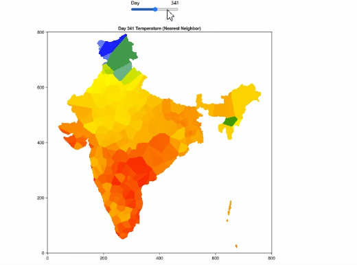

# **Temperature Visualization Dashboard (Bonito + WGLMakie)**  

This project is an **interactive temperature visualization dashboard** built using **Bonito** and **WGLMakie** in **Julia**. It displays a **colormapped heatmap** of India's temperature for different days using a **nearest-neighbor interpolation method**. The user can select a day using a **slider**, and the corresponding temperature map is displayed.  

---

## **📌 Features**
- **Interactive Day Slider**: Select a day (1 to 30) to view the temperature map.  
- **Colormapped Heatmap**: Uses a smooth gradient from **blue (cold)** to **red (hot)** to visualize temperature variations.  
- **Masked Regions**: Areas outside India are masked using a predefined `output.jpg` image.  
- **Optimized for Performance**: Uses **nearest-neighbor interpolation** for fast rendering.  
- **Bonito UI**: The app is styled using **Bonito's TailwindDashboard** for a clean and responsive layout.  

---

## **🚀 Installation & Setup**
### **1️⃣ Install Dependencies**
Make sure you have Julia installed, then add the required packages:  
```julia
using Pkg
Pkg.add(["Bonito", "WGLMakie", "DataFrames", "CSV", "ColorSchemes", "Images", "FileIO", "Makie"])
```
### **2️⃣ Clone the Repository**
```sh
Copy
Edit
git clone https://github.com/your-username/temperature-dashboard.git
cd temperature-dashboard
```

## **DEMO**

